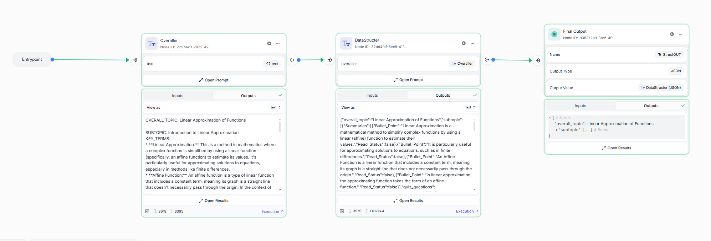
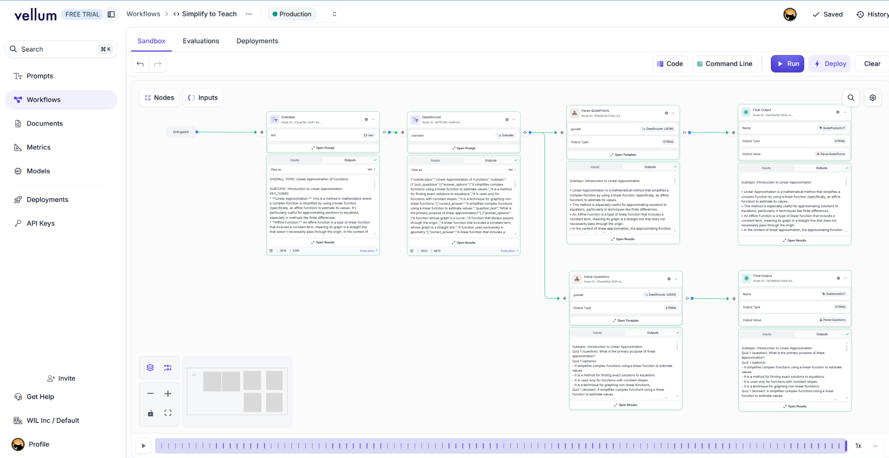

# Vellum AI Integration

We used **Vellum AI** to develop, test, and integrate our AI workflows. The screenshots demonstrate the implementation details:

## Workflow Implementation

1. **Text Parsing and Summarization**:

   * Initial parsed text from **Twelve Labs** and our custom browser parsing extension were provided to Vellum.
   * The parsed text was prompted to generate concise summaries.

2. **JSON Schema Transformation**:

   * Summarized text was transformed into a strictly defined JSON schema structure using Vellum's built-in capabilities.

## Alternate Workflow for Different JSON Schemas

For another workflow, we implemented a similar approach but utilized a different JSON schema structure:

* Outputs were internally divided and structured before being accessed through our API, demonstrating Vellum's flexibility in adapting workflows to varied data structures.

